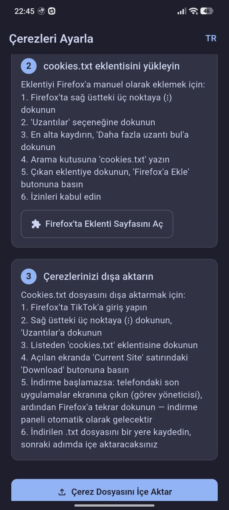
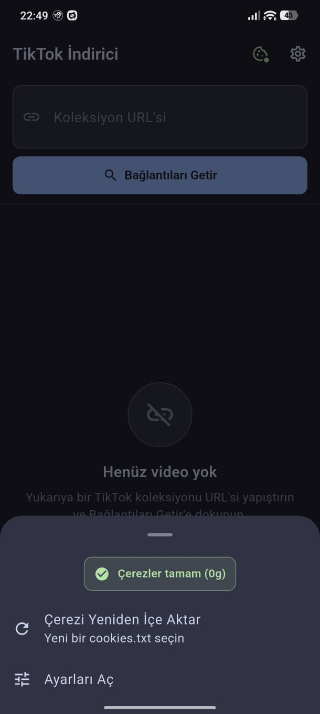
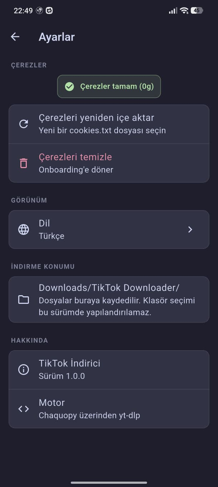

# TikTok Bulk Downloader

> TikTok koleksiyonlarını toplu indiren Android uygulaması.

[](#requirements--gereksinimler)
[](https://flutter.dev)
[](https://chaquo.com/chaquopy/)
[](LICENSE)
[](../../releases/latest)

---

## Screenshots / Ekran Görüntüleri

<p align="center">
  
  
  
  
</p>

> Ekran görüntüleri yakında eklenecek. (Görseller `docs/screenshots/` altına eklenecektir.)

---

## Features / Özellikler

- 📥 **Koleksiyon indirme** — TikTok profil veya koleksiyon bağlantısından tüm videoları tek seferde sıraya alır.
- ⏭️ **Akıllı atlama** — Daha önce indirilmiş videoları otomatik olarak tespit eder ve tekrar indirmez.
- 🔔 **Arka planda indirme** — Foreground service ile uygulama kapalıyken bile indirmeye devam eder.
- 🍪 **Çerez yönetimi** — `cookies.txt` dosyasını içe aktararak hesabınızla giriş yapın.
- 🔄 **Otomatik güncelleme kontrolü** — Yeni sürüm çıktığında uygulama sizi bilgilendirir.
- 🌍 **Türkçe / İngilizce dil desteği** — Sistem dilinize göre otomatik seçilir, ayarlardan değiştirilebilir.

---

## Requirements / Gereksinimler

- **Android 7.0+** (API 24 ve üzeri)
- **arm64 (64-bit ARM) cihaz** — 2016 ve sonrası neredeyse tüm telefonlar
- **Firefox Android** tarayıcısı + **"cookies.txt"** eklentisi (Lennon Hill)

> 32-bit (`armeabi-v7a`) ve x86 cihazlar desteklenmez. Chaquopy gömülü Python 3.12 yalnızca `arm64-v8a` üzerinde çalışır.

---

## Installation / Kurulum

1. APK'yı [Releases sayfasından](../../releases/latest) indirin (`tiktok-bulk-downloader-arm64-vX.Y.Z.apk`).
2. Android **Ayarlar → Uygulamalar → Özel uygulama erişimi → Bilinmeyen uygulamaları yükle** yolunu izleyip indirdiğiniz tarayıcıya (örn. Chrome, Firefox) **"Bilinmeyen kaynaklardan yükle"** iznini açın.
3. İndirilen APK dosyasına dokunup **Yükle** seçeneğine basın.
4. Uygulamayı açın ve **onboarding** adımlarını takip edin — uygulama sizi çerez içe aktarma adımına yönlendirecektir.

---

## Cookie Setup / Çerez Kurulumu

TikTok'tan indirme yapabilmek için tarayıcınızdan TikTok oturum çerezlerinizi dışa aktarmanız gerekir.

1. **Firefox Android**'i Play Store'dan kurun.
2. Firefox içinde **Ayarlar → Eklentiler** kısmından **"cookies.txt"** (Lennon Hill tarafından) eklentisini yükleyin.
3. Firefox üzerinden `tiktok.com` adresine gidin ve TikTok hesabınızla **giriş yapın**.
4. Adres çubuğunun yanındaki eklenti simgesine dokunup, **`cookies.txt` dosyasını dışa aktarın** (cihazınızın "İndirilenler" klasörüne kaydedilir).
5. Uygulamayı açın → **Çerez Yöneticisi** → **Dosya seç** ile az önce kaydettiğiniz `cookies.txt` dosyasını içe aktarın.

> Çerezler cihazınızda **Android Keystore** ile şifrelenerek saklanır. Hiçbir yere gönderilmez.

---

## FAQ / Sıkça Sorulan Sorular

**Neden Google Play Store'da yok?**
TikTok ile ilgili indirme uygulamaları Play Store'da kısa süre içinde kaldırılıyor. Bu nedenle uygulama yalnızca GitHub Releases üzerinden APK olarak dağıtılıyor.

**APK güvenli mi?**
Tüm kaynak kod açıktır ve her sürüm GitHub Actions üzerinde otomatik derlenip imzalanır. APK'ları daima resmi [Releases sayfasından](../../releases/latest) indirin — üçüncü taraf sitelere güvenmeyin.

**Çerezim çalışmıyor / "oturum süresi doldu" hatası alıyorum.**
TikTok çerezleri zamanla geçersiz hale gelir. Tarayıcıdan tekrar `cookies.txt` dosyası dışa aktarıp uygulamada güncelleyin. Ayrıca tarayıcıda TikTok'a tekrar giriş yapmış olmanız gerekir.

**x86 veya 32-bit cihazımda neden çalışmıyor?**
Uygulama, Python yorumlayıcısını cihazda çalıştırmak için Chaquopy kullanır. Chaquopy Python 3.12 yalnızca `arm64-v8a` cihazları destekler. Eski (pre-2016) 32-bit ARM ve x86 emülatörler/cihazlar desteklenmez.

**İndirilen videolar nereye kaydediliyor?**
İlk indirme sırasında uygulama, sizden bir kayıt klasörü seçmenizi ister (Android SAF — Storage Access Framework). Tüm videolar bu klasöre kaydedilir; dilediğiniz zaman ayarlardan değiştirebilirsiniz.

---

## Building from Source

For developers who want to build the APK locally.

**Prerequisites**
- Flutter SDK `^3.11.1`
- Android SDK with API 35 + NDK
- JDK 17

**Quick start**

```powershell
flutter pub get
flutter run                # debug build on a connected device
```

**Release build (signed)**

1. Generate a keystore outside the repo with `keytool -genkeypair`.
2. Create `android/key.properties` (gitignored):

   ```
   storeFile=C:\\path\\to\\keystore.jks
   storePassword=<store password>
   keyAlias=upload
   keyPassword=<key password>
   ```

3. Build the arm64 APK:

   ```powershell
   flutter build apk --release --target-platform android-arm64 -PtargetAbi=arm64-v8a
   ```

> **Why not `--split-per-abi`?** Chaquopy requires `ndk.abiFilters` to be set in `defaultConfig`, which is incompatible with the `splits.abi` block injected by Flutter's `--split-per-abi`. Scoping to a single ABI via `--target-platform` + `-PtargetAbi=...` is the supported workaround.

CI/CD is wired in [.github/workflows/release.yml](.github/workflows/release.yml) — pushing a tag matching `v*.*.*` builds and publishes a signed APK to a new GitHub Release.

---

## License / Lisans

Bu proje [MIT Lisansı](LICENSE) ile lisanslanmıştır.
This project is licensed under the [MIT License](LICENSE).

---

## Disclaimer / Sorumluluk Reddi

**TR.** Bu uygulama yalnızca kişisel kullanım amaçlıdır — indirme hakkına sahip olduğunuz içerikleri indirmek için kullanın. TikTok'un Hizmet Şartları'na ve içerik üreticilerinin haklarına saygı gösterin. Uygulamanın kötüye kullanımından geliştirici sorumlu tutulamaz.

**EN.** This tool is for personal use only — download content you have the right to download. Respect TikTok's Terms of Service and creators' rights. The maintainer is not responsible for misuse.
